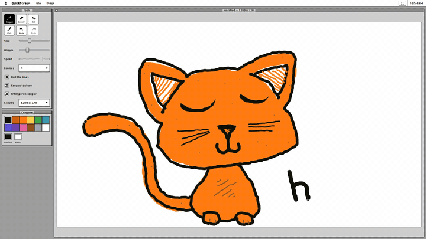
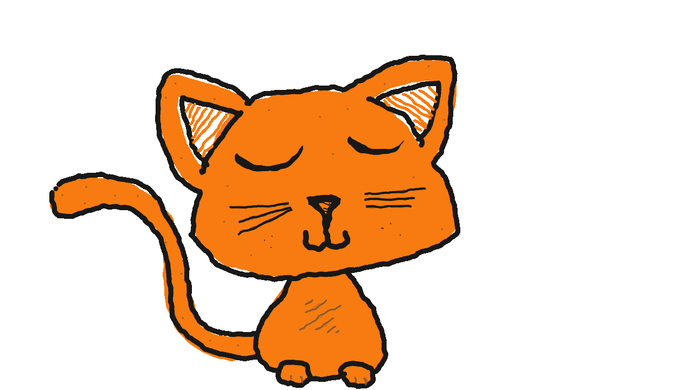
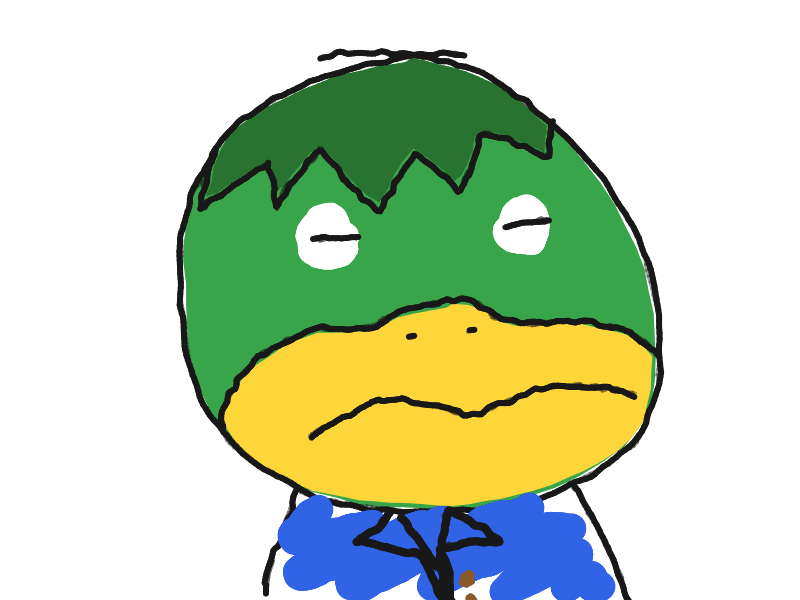
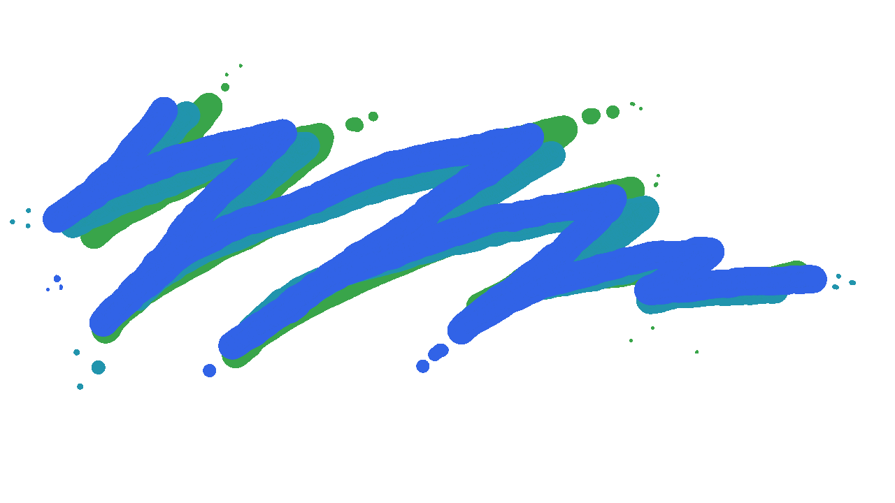

# QuickScrawl

A boiling-line oekaki toy. Draw things, have fun. Save `index.html` to run locally.

Supports `.gif` and `.webm` exporting.

Try it online - [https://selectinput.github.io/QuickScrawl/](https://selectinput.github.io/QuickScrawl/)

## Examples

## Generative AI Disclosure

This project was developed using generative AI for code creation.

## Credit & a note

If you find this interesting, please check out John Earnest (aka Internet Janitor)'s [WigglyPaint](https://internet-janitor.itch.io/wigglypaint), which uses line-boil but has a ton of other great features (and is free!).

Please also read his writeup about WigglyPaint: https://beyondloom.com/blog/onwigglypaint.html

This project was not meant to clone or replace WigglyPaint, and is for my own personal use, but I wanted to include these notes because there have been a flood of sites ripping off IJ's original and that's a shame. Give it a look.
